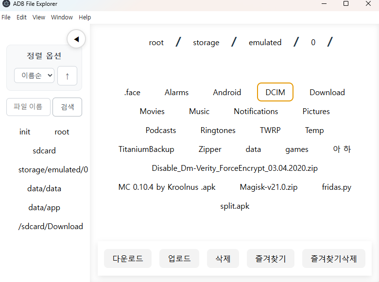
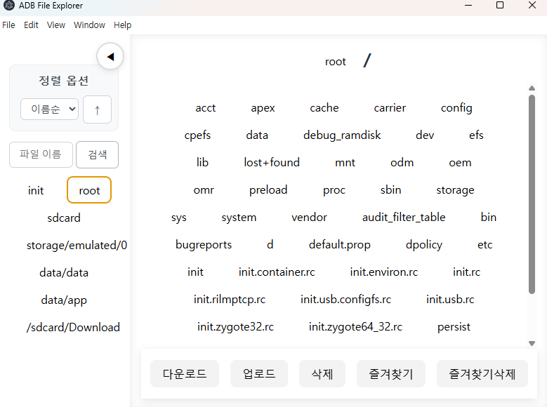

# ADB File Explorer

## 소개

이 앱은 **Android 기기와의 파일 관리 및 명령 실행**을 지원하는 데스크탑 GUI 툴입니다.  
ADB(안드로이드 디버그 브리지)를 활용하여 파일 탐색, 업로드/다운로드, 즐겨찾기 관리, 명령 실행 등을 제공합니다.

## 주요 기능

- **Android 파일 시스템 탐색**: 폴더/파일 구조를 GUI로 탐색
- **정렬/검색**: 이름, 날짜, 크기, 타입별 정렬 및 파일명 검색
- **파일 업로드/다운로드**: PC ↔ Android 간 파일 전송 (adb push/pull)
- **즐겨찾기**: 자주 쓰는 경로를 즐겨찾기로 저장/관리
- **명령 실행**: adb shell 명령 실행 및 결과 확인
- **반응형 UI**: 사이드바, 메인 컨텐츠, 고정된 하단 버튼 등 현대적 레이아웃

## 사용 기술

- **Electron**: 데스크탑 앱 프레임워크 (Node.js + Chromium)
- **React**: UI 컴포넌트 및 상태 관리
- **Vite**: 빠른 개발 환경 및 번들러
- **Framer Motion**: 애니메이션 효과
- **async-mutex**: Node.js에서 명령 실행 동기화
- **iconv-lite**: 인코딩 변환(ADB 출력 처리)
- **ADB**: Android 디바이스와의 통신

## 설치 및 실행

1. **의존성 설치**
   ```bash
   npm install
   ```

2. **React 서버 실행**
   ```bash
   npm run dev
   ```
   - Vite + React 서버가 실행됩니다.

3. 
   ```bash
   npm run start
   ```
   - 빌드된 파일이 있을 경우 Electron 앱만 실행합니다.

## 폴더 구조

```
frida-electron-app/
  electron/         # Electron 메인 프로세스 코드
  src/              # React 프론트엔드 코드
  public/           # 정적 파일
  package.json      # 프로젝트 설정 및 스크립트
  ...
```

## 주요 구현 방식

- **Electron의 IPC**로 프론트엔드(React)와 백엔드(Node.js) 간 통신
- **명령어 큐/뮤텍스**로 adb 명령의 동시 실행 방지
- **파일 다이얼로그**로 PC 파일 선택 및 경로 전달
- **로컬 JSON 파일**로 즐겨찾기 영구 저장
- **반응형 CSS**로 다양한 해상도 지원
- **실시간 상태 동기화**: 즐겨찾기 추가/삭제 시 자동 갱신

## 사용 예시

- 사이드바에서 경로를 탐색하고, 원하는 파일을 검색/정렬
- 하단 버튼으로 파일 업로드(PC→Android), 다운로드(Android→PC), 즐겨찾기 추가/삭제
- 즐겨찾기 경로는 앱 재시작 후에도 유지됨

## 개발/실행 환경

- Node.js 18+
- npm 9+
- Windows 10/11 (ADB, Electron, React 모두 크로스플랫폼 지원)

